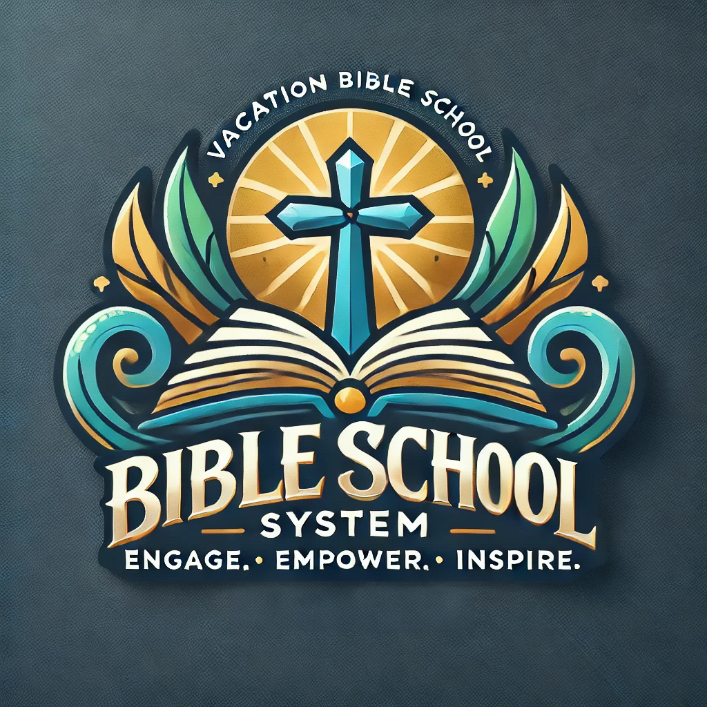

 

  
<h2 align="center">Vacation Bible School System</h3>

  

    The Vacation Bible School (VBS) System is an innovative web-based platform designed specifically for churches to simplify and modernise the administration of Vacation Bible Schools. Built with PHP and JavaScript, the system offers a seamless blend of functionality and ease of use, allowing churches to go paperless while delivering an exceptional experience for administrators, teachers, volunteers, and participants.
  

<!-- TABLE OF CONTENTS -->

  
Table of Contents

  <ol>
    <li>
      <a href="#about-the-project">About The Project</a>      
      <ul>
        <li><a href="#key-features">Key features</a></li>
        <li><a href="#built-with">Built With</a></li>
      </ul>
    </li>
    <li>
      <a href="#getting-started">Getting Started</a>
      <ul>
        <li><a href="#prerequisites">Prerequisites</a></li>
        <li><a href="#installation">Installation</a></li>
      </ul>
    </li>
    <li><a href="#usage">Usage</a></li>
    <li><a href="#roadmap">Roadmap</a></li>
    <li><a href="#contributing">Contributing</a></li>
    <li><a href="#license">License</a></li>
    <li><a href="#contact">Contact</a></li>
    <li><a href="#acknowledgments">Acknowledgments</a></li>
  </ol>

<!-- ABOUT THE PROJECT -->
## About The Project

Designed specifically for church environments, addressing unique needs like multi-level class assignments and teacher coordination.
Built with user-friendly interfaces powered by PHP and JavaScript, ensuring ease of use and efficient performance.
Encourages a paperless workflow, helping churches save time, reduce errors, and focus on delivering meaningful experiences.
QR code-based functionality promotes security and efficiency, ideal for managing large-scale Vacation Bible Schools.

This system not only simplifies the logistical challenges of conducting Vacation Bible School but also ensures that churches can focus on their mission of spreading faith and community-building.
Whether it’s a small congregation or a large church, the Vacation Bible School System empowers churches to deliver organised, impactful, and memorable VBS events.

## Key Features

_QR Code Registration and Check-in:_ 
Effortlessly manage participant registration and attendance with QR code technology. This feature streamlines the check-in process, eliminates manual errors, and ensures a swift and secure way to track attendees.

_Comprehensive Admin Controls:_ 
VBS Configuration: Set up and customise event details, schedules, and activities tailored to your church's needs.

_Teacher Management:_ 
Assign and organise teacher roles efficiently, ensuring smooth operations throughout the event.

_Class Assignments:_ 
Easily assign participants to their respective classes based on age groups or preferences.

_Attendance Management:_ 
Monitor attendance in real-time with intuitive dashboards, ensuring an accurate record of participant and volunteer engagement.

_Dynamic Reporting:_ 
Generate on-the-fly reports, including attendance summaries, session insights, and performance metrics. These insights enable churches to make informed decisions and improve future events.

_Paperless Operations:_ 
Transition from cumbersome paperwork to a fully digital platform, reducing administrative overhead and contributing to sustainability.

(<a href="#readme-top">back to top</a>)

### Built With

* [![PHP][PHP.net]][PHP-url]
* [![JavaScript][JavaScript]][JavaScript-url]
* [![JQuery][JQuery.com]][JQuery-url]
* [![DataTables][DataTables]][DataTables-url]

(<a href="#readme-top">back to top</a>)

<!-- GETTING STARTED -->
## Getting Started

Please follow the simple steps to setup VBS System either to your local server or a hosting provider.

### Prerequisites

Following are the prerequistes to running the VBS system.
* Web Server capable of running PHP
* mysql database
* Valid GMail account for emails*   

### Installation

1. Clone the repo
   
3. Copy the folder structure to your DocumentRoot (typically under htdocs in Apache)
   
4. Rename the folder from **Vacation-Bible-School-System** to **vbs** 
   
5. Execute the database setup using **DBSetup/db.sql**

6. Navigate to SERVER_URL/vbs/admin

7. Use the default username "admin" and password "admin" to login and setup the system [_Only if it is localhost_]. Please change the password directly in mysql database by updating the password hash with your preference (e.g https://www.files.gallery/tools/hash/) if its hosted on a public domain. It is highly recommended to change the admin password before setting up the system

(<a href="#readme-top">back to top</a>)

## Contributing

Contributions are what make the open source community such an amazing place to learn, inspire, and create. Any contributions you make are **greatly appreciated**.

If you have a suggestion that would make this better, please fork the repo and create a pull request. You can also simply open an issue with the tag "enhancement".
Don't forget to give the project a star! Thanks again!

1. Fork the Project
2. Create your Feature Branch (`git checkout -b feature/AmazingFeature`)
3. Commit your Changes (`git commit -m 'Add some AmazingFeature'`)
4. Push to the Branch (`git push origin feature/AmazingFeature`)
5. Open a Pull Request

(<a href="#readme-top">back to top</a>)

<!-- LICENSE -->
## License

Distributed under the GNU GENERAL PUBLIC LICENSE. See `LICENSE.txt` for more information.

(<a href="#readme-top">back to top</a>)

<!-- CONTACT -->
## Contact

Prabhu Maniraj [https://github.com/prabhu-qea](https://github.com/prabhu-qea)

Project Link: [https://github.com/github_username/repo_name](https://github.com/github_username/repo_name)

(<a href="#readme-top">back to top</a>)

<!-- MARKDOWN LINKS & IMAGES -->
<!-- https://www.markdownguide.org/basic-syntax/#reference-style-links -->
[JavaScript]: https://img.shields.io/badge/JavaScript-0769AD?style=for-the-badge&logo=JavaScript&logoColor=white
[JavaScript-url]: https://developer.mozilla.org/en-US/docs/Web/JavaScript
[JQuery.com]: https://img.shields.io/badge/jQuery-0769AD?style=for-the-badge&logo=jquery&logoColor=white
[JQuery-url]: https://jquery.com
[PHP.net]: https://img.shields.io/badge/php-4F5B93?style=for-the-badge&logo=PHP&logoColor=white
[PHP-url]: https://www.php.net
[DataTables]: https://img.shields.io/badge/DataTables-4F5B93?style=for-the-badge&logo=DataTables&logoColor=white
[DataTables-url]: https://datatables.net
